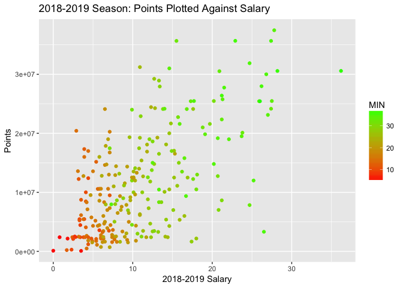

Sports Analytics - An Introduction in R
================
Yongqi Gan

R and R Markdown
----------------

R is one of the most popular statistical programming languages. R is the only widely-used statistical programming language that is free and open source, with a wide developer community that contributes to the core language and corresponding packages. This file was created with RStudio, our recommended IDE for use with R. For more information and to download, see <https://rstudio.com>.

This is an R Markdown document generated by knitr and RStudio. Markdown is a simple formatting syntax for authoring HTML, PDF, and MS Word documents. For more details on using R Markdown see <http://rmarkdown.rstudio.com>.

When you click the **Knit** button a document will be generated that includes both content as well as the output of any embedded R code chunks within the document. You can embed an R code chunk and its corresponding output like this:

``` r
summary(cars)
```

    ##      speed           dist       
    ##  Min.   : 4.0   Min.   :  2.00  
    ##  1st Qu.:12.0   1st Qu.: 26.00  
    ##  Median :15.0   Median : 36.00  
    ##  Mean   :15.4   Mean   : 42.98  
    ##  3rd Qu.:19.0   3rd Qu.: 56.00  
    ##  Max.   :25.0   Max.   :120.00

Loading Data
------------

We are examining two datasets: The NBA player statistics and their historical salaries for the last 4 years.

Sources: <https://stats.nba.com/> for performance data and <https://hoopshype.com/salaries/players/> for salary data.

Let us first load the performance data into our R environment using the read.csv function. The `header = TRUE` flag tells the console that the first row of the file contains column names.

``` r
players1819 <- read.csv(file = "players18-19.csv", header = TRUE)
players1718 <- read.csv(file = "players17-18.csv", header = TRUE)
players1617 <- read.csv(file = "players16-17.csv", header = TRUE)
players1516 <- read.csv(file = "players15-16.csv", header = TRUE)
```

and the salary data...

``` r
salary1819 <- read.csv(file = "18-19_salary.csv", header = TRUE)
salary1718 <- read.csv(file = "17-18_salary.csv", header = TRUE)
salary1617 <- read.csv(file = "16-17_salary.csv", header = TRUE)
salary1516 <- read.csv(file = "15-16_salary.csv", header = TRUE)
```

Cleaning Data
-------------

We will now merge the four dataframes for salary data and remove the individual datasets from our working environment. Note that we only include players that are accounted for in all four datasets to ensure consistency in our analysis.

``` r
#merge concactenates two dataframes together by values in a certain row or column.
df_salary <- merge(salary1516, salary1617, by.x = "Player", by.y = "Player")
df_salary <- merge(df_salary, salary1718, by.x = "Player", by.y = "Player")
df_salary <- merge(df_salary, salary1819, by.x = "Player", by.y = "Player")

#rm removes dataframes and vectors from our local working environment.
#rm(salary1516, salary1617, salary1718, salary1819)
```

There are some issues with our data. If you click on the df\_salary dataframe in the "environment" pane on the right, you will see that the year columns have weird names and that the dollar amounts are treated as factors. Factors are categorical variables best used to describe types of values (animals classified as "dog" "cat" etc.) This is undesirable for use in numerical data, and will impact any plotting or statistical analysis we want to do. Therefore, we will convert the factor vectors into numeric vectors and rename them using the code snippet below.

``` r
names(df_salary) <- c("Player", "y1516", "y1617", "y1718", "y1819")

df_salary$Player <- as.character(df_salary$Player)

df_salary$y1516 = as.numeric(gsub("[\\$,]", "", as.character(df_salary$y1516)))
df_salary$y1617 = as.numeric(gsub("[\\$,]", "", as.character(df_salary$y1617)))
df_salary$y1718 = as.numeric(gsub("[\\$,]", "", as.character(df_salary$y1718)))
df_salary$y1819 = as.numeric(gsub("[\\$,]", "", as.character(df_salary$y1819)))

#Trim unnecessary whitespace to prevent string matching errors
df_salary$Player = trimws(df_salary$Player)
```

Preliminary Analysis, Plotting, Data Visualization
--------------------------------------------------

We want to get an overview of the data in order to get an idea of how to consider analyzing it. We can start by simply viewing the header of the salary data, shown below.

``` r
head(df_salary)
```

    ##            Player    y1516    y1617    y1718    y1819
    ## 1    Aaron Gordon  4405071  4549389  5662481 21590909
    ## 2      Al Horford 12671359 27748190 28530811 28928710
    ## 3    Al Jefferson 14255279 10695850 10050366  4000000
    ## 4 Al-Farouq Aminu  8492868  8030598  7529204  6957105
    ## 5   Alan Williams   120677   914448  6172292    77250
    ## 6      Alec Burks  9728947 10355341 11156939 11536515

We can make a dotplot of 2018-2019 season salaries against points scored using the ggplot2 package, a popul. We will also show minutes played using a color gradient.

``` r
require(ggplot2)
```

    ## Loading required package: ggplot2

``` r
require(scales)
```

    ## Loading required package: scales

``` r
data1819 <- merge(df_salary, players1819, by.x = "Player", by.y = "PLAYER")

p <- ggplot(data = data1819, aes(x = y1819, y = PTS, colour = MIN))
p + scale_x_continuous(labels = comma) + xlab("2018-2019 Salary") + 
  ylab("Points") + ggtitle("2018-2019 Season: Points Plotted Against Salary") + 
  scale_color_gradient(low="red", high="green") + geom_point()
```



Interesting. We see that a higher salary is generally correlated with more scored points and more minutes played on average. This is likely an obvious observation to most of you, but it is helpful to see it confirmed graphically.

The visual examination leads us to believe that there is a positive relationship between salary and scored points. Let's run a linear regression model to examine this numerically.

``` r
#lm stands for "linear model"
points_salary <- lm(y1819 ~ PTS, data = data1819)
summary(points_salary)
```

    ## 
    ## Call:
    ## lm(formula = y1819 ~ PTS, data = data1819)
    ## 
    ## Residuals:
    ##       Min        1Q    Median        3Q       Max 
    ## -21203611  -4704150   -789194   4028796  20410886 
    ## 
    ## Coefficients:
    ##             Estimate Std. Error t value Pr(>|t|)    
    ## (Intercept)  2174352     830607   2.618  0.00938 ** 
    ## PTS           843156      65573  12.858  < 2e-16 ***
    ## ---
    ## Signif. codes:  0 '***' 0.001 '**' 0.01 '*' 0.05 '.' 0.1 ' ' 1
    ## 
    ## Residual standard error: 6814000 on 254 degrees of freedom
    ## Multiple R-squared:  0.3943, Adjusted R-squared:  0.3919 
    ## F-statistic: 165.3 on 1 and 254 DF,  p-value: < 2.2e-16

Let's interpret this regression output. The line of best fit is given by data1819 = 2,174,352 + 843,156 \* PTS. We can interpret this to mean that for every additional point scored, on average the salary of that player will increase by 843,156 dollars. We note the small p-value (less than 2<sup>−16</sup>), implying our results are statistically significant at the 99.99% confidence level.

Optimization Example: Linear Programming
----------------------------------------

To demonstrate the power of R packages, let's consider a hypothetical scenario: You are the manager of an NBA team. Your goal is to score at least 100 points every game on average, while spending as little as possible on the players' salaries.

This is an optimization problem. We are trying to minimize a cost function (total salary cost), given a constraint (average at least 100 points). We can solve this optimization problem using a technique known as linear programming. For technical details you are welcome to review <https://www.math.ucla.edu/~tom/LP.pdf>; however, a technical understanding of the algorithm is not necessary for this example.

We will use a R package built by Michel Berkelaar, lpSolve, to solve this problem. R packages are custom-written libraries developed by statistians, companies, and other users to extend or the functionality of R or to simplify certain procedures.

``` r
require(lpSolve)
```

    ## Loading required package: lpSolve

``` r
# obj represents the objective function. This is the function that calculates the total cost of the team and is what we are trying to minimize.
obj <- data1819$y1819
#constr represents the constraint functions. These are the conditions that a valid solution must satisfy. The conditions we impose are that the "team" must have a minimum sum of 100 points per game, the team must have at least 12 players, and each player can only be chosen at most once.
constr <- matrix(append(append(data1819$PTS, rep(1, times = 256)), as.vector(diag(nrow = 256))), nrow = 258, byrow = TRUE)
#right represents the right hand side of the constraint functions.
right <- c(100, 12, rep(1, times = 256))
#constraints_direction represents the sign of the constraint functions.
constranints_direction  <- c(">=", ">=", rep("<=", times = 256))
optimum <-  lp(direction="min",
               objective.in = obj,
               const.mat = constr,
               const.dir = constranints_direction,
               const.rhs = right,
               all.int = T)

best_sol <- optimum$solution
names(best_sol) <- data1819$Player
print(best_sol)
```

    ##             Aaron Gordon               Al Horford          Al-Farouq Aminu 
    ##                        0                        0                        0 
    ##            Alan Williams               Alec Burks                 Alex Len 
    ##                        1                        0                        0 
    ##             Allen Crabbe             Amir Johnson           Andre Drummond 
    ##                        0                        0                        0 
    ##           Andre Iguodala             Andrew Bogut           Andrew Wiggins 
    ##                        0                        1                        0 
    ##            Anthony Davis         Anthony Tolliver              Aron Baynes 
    ##                        0                        0                        0 
    ##            Austin Rivers            Avery Bradley             Ben McLemore 
    ##                        0                        0                        0 
    ##          Bismack Biyombo            Blake Griffin         Boban Marjanovic 
    ##                        0                        0                        0 
    ##             Bobby Portis         Bojan Bogdanovic             Bradley Beal 
    ##                        0                        0                        0 
    ##           Brandon Knight              Brook Lopez            Bruno Caboclo 
    ##                        0                        0                        1 
    ##            Cameron Payne          Carmelo Anthony         Chandler Parsons 
    ##                        0                        0                        0 
    ##            Channing Frye               Chris Paul              CJ McCollum 
    ##                        0                        0                        0 
    ##                 CJ Miles             Clint Capela              Cody Zeller 
    ##                        0                        0                        0 
    ##             Corey Brewer              Cory Joseph             Courtney Lee 
    ##                        1                        0                        0 
    ##        Cristiano Felicio         D'Angelo Russell           Damian Lillard 
    ##                        0                        0                        0 
    ##         Danilo Gallinari              Danny Green         Dante Cunningham 
    ##                        0                        0                        0 
    ##               Dante Exum          Darren Collison           DeAndre Jordan 
    ##                        0                        0                        0 
    ##             Delon Wright            DeMar DeRozan         DeMarcus Cousins 
    ##                        0                        0                        0 
    ##          DeMarre Carroll           Derrick Favors             Derrick Rose 
    ##                        0                        0                        1 
    ##             Devin Booker             Devin Harris           Dewayne Dedmon 
    ##                        1                        0                        0 
    ##             Dion Waiters            Dirk Nowitzki           Doug McDermott 
    ##                        0                        0                        0 
    ##           Draymond Green            Dwight Howard            Dwight Powell 
    ##                        0                        0                        0 
    ##              Dwyane Wade            E'Twaun Moore                 Ed Davis 
    ##                        0                        0                        0 
    ##            Elfrid Payton          Emmanuel Mudiay              Enes Kanter 
    ##                        0                        0                        0 
    ##             Eric Bledsoe              Eric Gordon           Ersan Ilyasova 
    ##                        0                        0                        0 
    ##            Evan Fournier              Evan Turner           Frank Kaminsky 
    ##                        0                        0                        0 
    ##           Garrett Temple              Gary Harris              George Hill 
    ##                        0                        0                        0 
    ##             Gerald Green    Giannis Antetokounmpo       Glenn Robinson III 
    ##                        1                        0                        0 
    ##             Goran Dragic           Gordon Hayward             Gorgui Dieng 
    ##                        0                        0                        0 
    ##              Greg Monroe          Harrison Barnes         Hassan Whiteside 
    ##                        0                        0                        0 
    ##                Ian Clark              Ian Mahinmi            Iman Shumpert 
    ##                        0                        0                        0 
    ##            Isaiah Canaan            Isaiah Thomas            Jabari Parker 
    ##                        1                        0                        0 
    ##              Jae Crowder            Jahlil Okafor           Jamal Crawford 
    ##                        0                        0                        0 
    ##             James Harden            James Johnson           JaMychal Green 
    ##                        0                        0                        0 
    ##             Jared Dudley            Jarell Martin              Jason Smith 
    ##                        0                        0                        0 
    ##             JaVale McGee               Jeff Green              Jeff Teague 
    ##                        0                        0                        0 
    ##             Jerami Grant              Jeremy Lamb               Jeremy Lin 
    ##                        0                        0                        0 
    ##             Jerian Grant           Jerryd Bayless             Jimmy Butler 
    ##                        0                        0                        0 
    ##                JJ Redick              Joakim Noah              Jodie Meeks 
    ##                        0                        0                        0 
    ##               Joe Harris               Joe Ingles              Joel Embiid 
    ##                        0                        0                        0 
    ##              John Henson                John Wall                Jon Leuer 
    ##                        0                        0                        0 
    ##            Jonas Jerebko        Jonas Valanciunas         Jonathon Simmons 
    ##                        0                        0                        0 
    ##          Jordan Clarkson            Jose Calderon          Josh Richardson 
    ##                        0                        0                        0 
    ##                 JR Smith             Jrue Holiday            Julius Randle 
    ##                        0                        0                        0 
    ##          Justin Anderson           Justin Holiday          Justise Winslow 
    ##                        0                        0                        0 
    ##             Jusuf Nurkic       Karl-Anthony Towns            Kawhi Leonard 
    ##                        0                        0                        0 
    ##             Kelly Olynyk             Kemba Walker           Kenneth Faried 
    ##                        0                        0                        0 
    ##            Kent Bazemore Kentavious Caldwell-Pope             Kevin Durant 
    ##                        0                        0                        0 
    ##               Kevin Love             Kevon Looney          Khris Middleton 
    ##                        0                        0                        0 
    ##            Klay Thompson             Kosta Koufos            Kyle Anderson 
    ##                        0                        0                        0 
    ##              Kyle Korver               Kyle Lowry             Kyle O'Quinn 
    ##                        0                        0                        0 
    ##             Kyrie Irving        LaMarcus Aldridge         Lance Stephenson 
    ##                        0                        0                        0 
    ##             Lance Thomas        Langston Galloway             LeBron James 
    ##                        0                        0                        0 
    ##         Luc Mbah a Moute                Luol Deng               Marc Gasol 
    ##                        0                        0                        0 
    ##            Marcin Gortat          Marco Belinelli            Marcus Morris 
    ##                        0                        0                        0 
    ##             Marcus Smart            Mario Hezonja          Markieff Morris 
    ##                        0                        0                        0 
    ##          Marvin Williams            Mason Plumlee      Matthew Dellavedova 
    ##                        0                        0                        0 
    ##           Meyers Leonard          Michael Beasley  Michael Carter-Williams 
    ##                        0                        0                        0 
    ##   Michael Kidd-Gilchrist              Mike Conley             Mike Muscala 
    ##                        0                        0                        0 
    ##               Mike Scott            Miles Plumlee         Montrezl Harrell 
    ##                        0                        0                        0 
    ##             Myles Turner          Nemanja Bjelica             Nerlens Noel 
    ##                        0                        0                        0 
    ##               Nick Young            Nicolas Batum             Nik Stauskas 
    ##                        1                        0                        0 
    ##             Nikola Jokic           Nikola Mirotic           Nikola Vucevic 
    ##                        0                        0                        0 
    ##              Noah Vonleh            Norman Powell              Omri Casspi 
    ##                        0                        0                        0 
    ##          Pat Connaughton         Patrick Beverley        Patrick Patterson 
    ##                        0                        0                        0 
    ##                Pau Gasol              Paul George             Paul Millsap 
    ##                        0                        0                        0 
    ##                PJ Tucker               Quincy Acy         Quincy Pondexter 
    ##                        0                        1                        0 
    ##              Rajon Rondo                Raul Neto           Raymond Felton 
    ##                        0                        0                        0 
    ##           Reggie Bullock           Reggie Jackson           Richaun Holmes 
    ##                        0                        0                        0 
    ##              Ricky Rubio         Robert Covington              Robin Lopez 
    ##                        0                        0                        0 
    ##              Rodney Hood  Rondae Hollis-Jefferson                 Rudy Gay 
    ##                        0                        0                        0 
    ##              Rudy Gobert        Russell Westbrook            Ryan Anderson 
    ##                        0                        0                        0 
    ##              Salah Mejri               Sam Dekker              Serge Ibaka 
    ##                        0                        0                        0 
    ##               Seth Curry           Shabazz Napier         Shaun Livingston 
    ##                        0                        0                        0 
    ##             Shelvin Mack             Solomon Hill        Spencer Dinwiddie 
    ##                        0                        0                        1 
    ##          Stanley Johnson            Stephen Curry             Steven Adams 
    ##                        0                        0                        0 
    ##               Taj Gibson            Terrence Ross             Terry Rozier 
    ##                        0                        0                        0 
    ##          Thabo Sefolosha           Thaddeus Young              Tim Frazier 
    ##                        0                        0                        0 
    ##            Tobias Harris              Tony Parker               Tony Snell 
    ##                        0                        0                        0 
    ##           Treveon Graham             Trevor Ariza               Trey Burke 
    ##                        0                        0                        0 
    ##               Trey Lyles         Tristan Thompson             Troy Daniels 
    ##                        0                        0                        0 
    ##            Tyler Johnson             Tyler Zeller             Tyreke Evans 
    ##                        0                        1                        0 
    ##           Tyson Chandler               Tyus Jones            Udonis Haslem 
    ##                        0                        0                        0 
    ##           Victor Oladipo             Vince Carter          Wayne Ellington 
    ##                        0                        0                        0 
    ##           Wesley Johnson          Wesley Matthews              Will Barton 
    ##                        0                        0                        0 
    ##      Willie Cauley-Stein          Wilson Chandler              Zach LaVine 
    ##                        0                        0                        0 
    ##            Zaza Pachulia 
    ##                        0

The players with a "1" under their name have been chosen for this "optimal" team.

``` r
print(paste("Total cost: ", optimum$objval, sep=""))
```

    ## [1] "Total cost: 12387465"

We find that the total cost of this "optimal" team is 12.387 million dollars.
