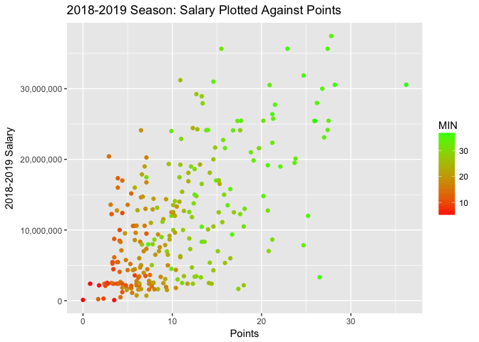

Sports Analytics - An Introduction in R
================
Yongqi Gan

R and R Markdown
----------------

R is one of the most popular statistical programming languages. R is the only widely-used statistical programming language that is free and open source, with a wide developer community that contributes to the core language and corresponding packages. This file was created with RStudio, our recommended IDE for use with R. For more information and to download, see <https://rstudio.com>.

This is an R Markdown document generated by knitr and RStudio. Markdown is a simple formatting syntax for authoring HTML, PDF, and MS Word documents. For more details on using R Markdown see <http://rmarkdown.rstudio.com>.

When you click the **Knit** button a document will be generated that includes both content as well as the output of any embedded R code chunks within the document. You can embed an R code chunk and its corresponding output like this:

``` r
summary(cars)
```

    ##      speed           dist       
    ##  Min.   : 4.0   Min.   :  2.00  
    ##  1st Qu.:12.0   1st Qu.: 26.00  
    ##  Median :15.0   Median : 36.00  
    ##  Mean   :15.4   Mean   : 42.98  
    ##  3rd Qu.:19.0   3rd Qu.: 56.00  
    ##  Max.   :25.0   Max.   :120.00

Loading Data
------------

We are examining two datasets: The NBA player statistics and their historical salaries for the last 4 years.

Sources: <https://stats.nba.com/> for performance data and <https://hoopshype.com/salaries/players/> for salary data.

Let us first load the performance data into our R environment using the read.csv function. The `header = TRUE` flag tells the console that the first row of the file contains column names.

``` r
players1819 <- read.csv(file = "players18-19.csv", header = TRUE)
players1718 <- read.csv(file = "players17-18.csv", header = TRUE)
players1617 <- read.csv(file = "players16-17.csv", header = TRUE)
players1516 <- read.csv(file = "players15-16.csv", header = TRUE)
```

and the salary data...

``` r
salary1819 <- read.csv(file = "18-19_salary.csv", header = TRUE)
salary1718 <- read.csv(file = "17-18_salary.csv", header = TRUE)
salary1617 <- read.csv(file = "16-17_salary.csv", header = TRUE)
salary1516 <- read.csv(file = "15-16_salary.csv", header = TRUE)
```

Cleaning Data
-------------

We will now merge the four dataframes for salary data and remove the individual datasets from our working environment. Note that we only include players that are accounted for in all four datasets to ensure consistency in our analysis.

``` r
#merge concactenates two dataframes together by values in a certain row or column.
df_salary <- merge(salary1516, salary1617, by.x = "Player", by.y = "Player")
df_salary <- merge(df_salary, salary1718, by.x = "Player", by.y = "Player")
df_salary <- merge(df_salary, salary1819, by.x = "Player", by.y = "Player")

#rm removes dataframes and vectors from our local working environment.
#rm(salary1516, salary1617, salary1718, salary1819)
```

There are some issues with our data. If you click on the df\_salary dataframe in the "environment" pane on the right, you will see that the year columns have weird names and that the dollar amounts are treated as factors. Factors are categorical variables best used to describe types of values (animals classified as "dog" "cat" etc.) This is undesirable for use in numerical data, and will impact any plotting or statistical analysis we want to do. Therefore, we will convert the factor vectors into numeric vectors and rename them using the code snippet below.

``` r
names(df_salary) <- c("Player", "y1516", "y1617", "y1718", "y1819")

df_salary$Player <- as.character(df_salary$Player)

df_salary$y1516 = as.numeric(gsub("[\\$,]", "", as.character(df_salary$y1516)))
df_salary$y1617 = as.numeric(gsub("[\\$,]", "", as.character(df_salary$y1617)))
df_salary$y1718 = as.numeric(gsub("[\\$,]", "", as.character(df_salary$y1718)))
df_salary$y1819 = as.numeric(gsub("[\\$,]", "", as.character(df_salary$y1819)))

df_salary$Player = trimws(df_salary$Player)
```

Preliminary Analysis, Plotting, Data Visualization
--------------------------------------------------

We want to get an overview of the data in order to get an idea of how to consider analyzing it. We can start by simply viewing the header of the salary data, shown below.

``` r
head(df_salary)
```

    ##            Player    y1516    y1617    y1718    y1819
    ## 1    Aaron Gordon  4405071  4549389  5662481 21590909
    ## 2      Al Horford 12671359 27748190 28530811 28928710
    ## 3    Al Jefferson 14255279 10695850 10050366  4000000
    ## 4 Al-Farouq Aminu  8492868  8030598  7529204  6957105
    ## 5   Alan Williams   120677   914448  6172292    77250
    ## 6      Alec Burks  9728947 10355341 11156939 11536515

We can make a dotplot of 2018-2019 season salaries against points scored using the ggplot2 package, a popul. We will also show minutes played using a color gradient.

``` r
require(ggplot2)
```

    ## Loading required package: ggplot2

``` r
require(scales)
```

    ## Loading required package: scales

``` r
data1819 <- merge(df_salary, players1819, by.x = "Player", by.y = "PLAYER")

p <- ggplot(data = data1819, aes(x = y1819, y = PTS, colour = MIN))
p + scale_x_continuous(labels = comma) + xlab("2018-2019 Salary") + 
  ylab("Points") + ggtitle("2018-2019 Season: Points Plotted Against Salary") + 
  scale_color_gradient(low="red", high="green") + geom_point()
```



Interesting. We see that
